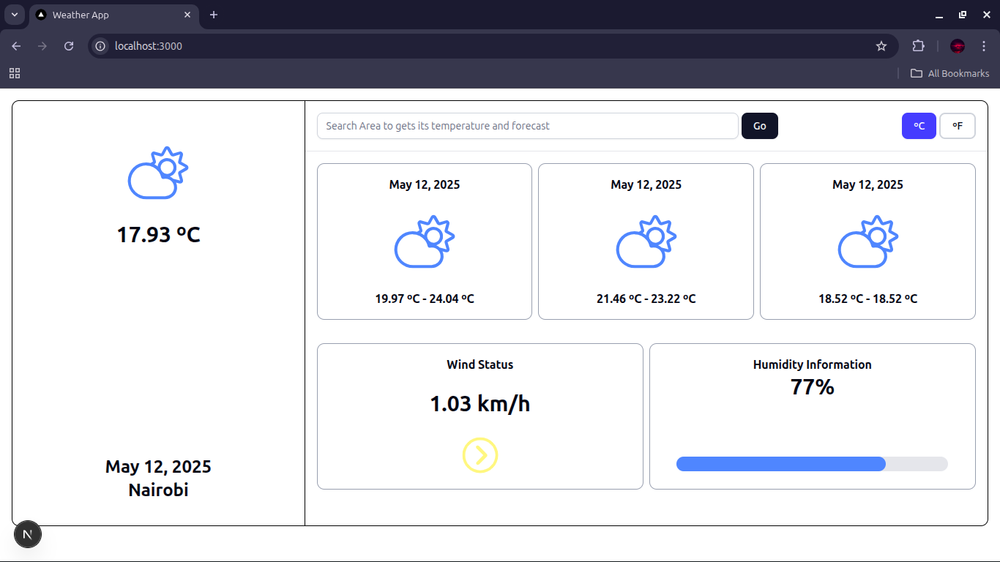
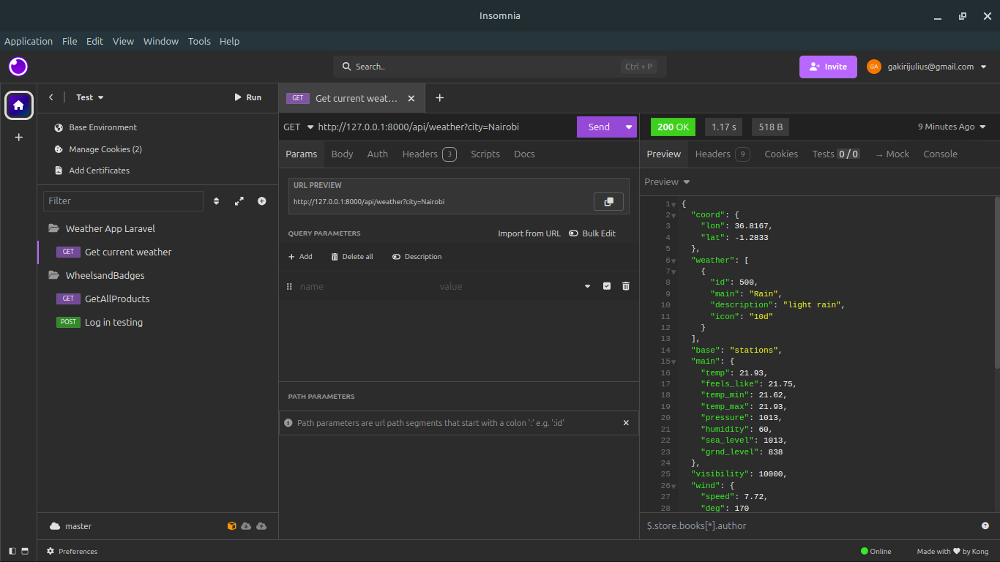
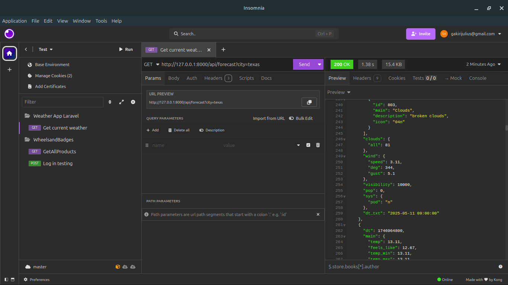

# 🌤️ Weather Application.

This project is a **decoupled weather app** built using **Next.js (with TypeScript)** for the frontend and **Laravel (latest)** for the backend. It integrates with the **OpenWeatherMap API** to fetch current weather information based on a user’s query.

## Stack Overview
- Frontend - Next.js, TypeScript, Tailwind CSS, RippleUI
- Backend - Laravel (API only)
- Weather API - [OpenWeatherMap](https://openweathermap.org/api)
- HTTP Client - Fetch API (frontend), Laravel HTTP client (backend)

---

## Features

- Search for any city and get current weather information
- Responsive, clean UI built using RippleUI components
- Fully decoupled architecture using REST API
- AJAX-based API communication
- Well-structured code and reusable components
- Fully typed using TypeScript
- Graceful error handling

---

## Project Structure

### Frontend (Next.js)
- `/components` – Reusable UI components
- `app/page.tsx` – App routes (`WeatherApp`)
- `/search.ts` – Fetch wrapper for backend API

### Backend (Laravel)
- `/routes/api.php` – All API endpoints
- `/app/Http/Controllers/Api/WeatherController.php` – Logic to handle weather requests
- `/config/services.php` – Handles OpenWeatherMap API interaction
- `.env` – Stores API key for OpenWeatherMap

---

## Getting Started

### Prerequisites
- Node.js & npm/yarn
- PHP >= 8.1, Composer
- [OpenWeatherMap API Key](https://openweathermap.org/api)

---

### Installation

#### Clone the repository:
```bash
git clone https://github.com/Gakiri001/weather-app-assessment.git
cd weather-app-assessment
```

## 📸 Screenshots
### Weather Application



### Weather API Testing



### Forecast API Testing


